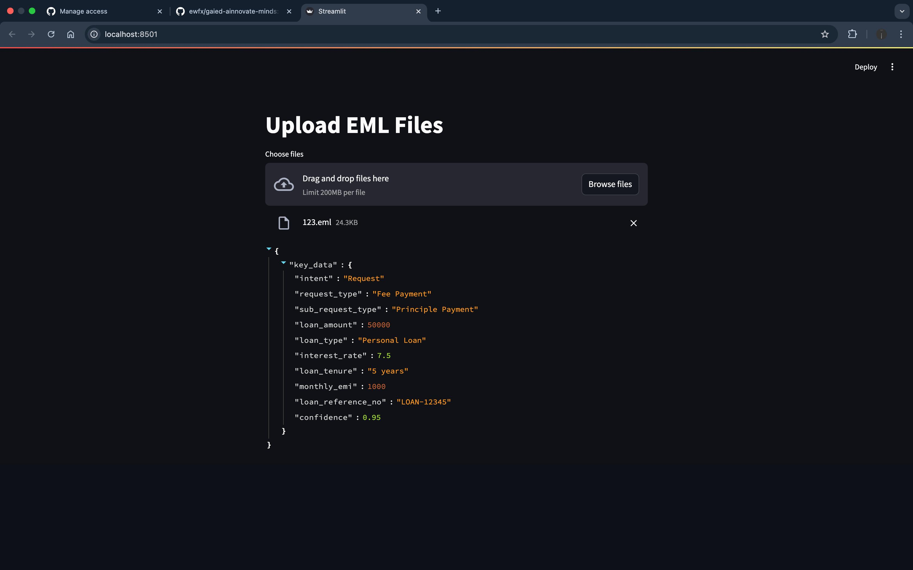

# 🚀 AI-Powered Email Classification & OCR for Loan Servicing  

## 📌 Table of Contents  
- [🎯 Introduction](#-introduction)  
- [🎥 Demo](#-demo)  
- [💡 Inspiration](#-inspiration)  
- [⚙️ What It Does](#-what-it-does)  
- [🛠️ How We Built It](#-how-we-built-it)  
- [🚧 Challenges We Faced](#-challenges-we-faced)  
- [🏃 How to Run](#-how-to-run)  
- [🏗️ Tech Stack](#-tech-stack)  
- [👥 Team](#-team)  

---

## 🎯 **Introduction**  
Loan servicing teams handle **thousands of emails daily**, often containing **multiple requests, attachments, and redundant follow-ups**. Manual processing is **slow, error-prone, and resource-intensive**.  

This project **automates the classification and processing of emails** using **AI, NLP, and OCR**. It enables:  
✔️ **Email classification** based on request intent  
✔️ **Data extraction** from email bodies & attachments  
✔️ **Multi-request handling with primary intent detection**  
✔️ **Duplicate email detection** to prevent redundancy  

This solution enhances **efficiency, accuracy, and scalability** in loan servicing workflows.  

---

## 🎥 **Demo**  
📹 **[Click for Project Demo](https://drive.google.com/file/d/1kW4pSn6t2D-rGK0b4ryxmpibqYCnoFzx/view?usp=sharing)** 

📹 **[Click for Code Walkthrough](https://drive.google.com/file/d/16OPnANrlMc45v09_7X8CcIf0Bd33JjUH/view?usp=sharing)** 


🖼️ **Screenshots:** 

**Output**

  


**Duplicate check**

  

---

## 💡 **Inspiration**  
Loan servicing teams face **high email volumes, unstructured data, and redundant service requests**.  

We aimed to build a **scalable AI-powered automation system** that:  
- **Understands email context & classifies requests accurately**  
- **Extracts key data from emails & documents**  
- **Identifies primary request intent in multi-topic emails**  
- **Detects duplicate emails to prevent redundant processing**  

---

## ⚙️ **What It Does**  
✅ **Email Classification:** Categorizes emails into predefined request types & subtypes with reasoning  
✅ **Context-Based Data Extraction:** Extracts configurable fields (loan amount, deal name, expiration date, etc.)  
✅ **Multi-Request Handling:** Identifies multiple request types & determines the **primary intent**  
✅ **Priority-Based Extraction:** Prioritizes email body over attachments while extracting numerical fields  
✅ **Duplicate Email Detection:** Identifies forwarded/replied emails & prevents redundant service requests  

🔹 **Example Output:**  
      **Intent:** Request  
      **Request Type:** Fee Payment (Confidence: 95%)  
      **Sub-Request Type:** Principle Payment  
      **Loan Amount:** $50,000  
      **Loan Type:** Personal Loan  
      **Interest Rate:** 7.5%  
      **Loan Tenure:** 5 years  
      **Monthly EMI:** $1,000  
      **Loan Reference No.:** LOAN-12345  
      **Duplicate Status:** No  

---

## 🛠️ **How We Built It**  
We leveraged **cutting-edge AI, NLP, and automation tools** to develop this system.  

🔹 **Technologies Used:**  
- **AI Models:** Google Gemini, langchain_google_genai
- **OCR & Data Extraction:** Pytesseract, pdf2image, python-docx  
- **Email Processing:** email.parser, MIME handling libraries  
- **Duplicate Detection:** eml.parser, hashing
- **Data Processing:** pydantic, langchain, json
- **UI:** Streamlit  

🔹 **Workflow:**  
1️⃣ **Parse emails & extract attachments**  
2️⃣ **Classify request types using AI models**  
3️⃣ **Extract relevant numerical/text fields**  
4️⃣ **Detect multiple requests & identify primary intent**  
5️⃣ **Check for duplicate emails & prevent redundant processing**  
6️⃣ **Return structured output for seamless integration**  

---

## 🚧 **Challenges We Faced**  
🔸 **Handling unstructured email formats** – Emails & attachments vary widely in structure  
🔸 **Ensuring high classification accuracy** – Fine-tuning LLMs for reliable request categorization  
🔸 **Extracting data contextually** – Adapting extraction rules to different request types  
🔸 **Multi-request processing** – Determining primary intent in complex cases  
🔸 **Duplicate detection efficiency** – Balancing speed & accuracy in similarity checks  

Through **iterative improvements and AI-powered automation**, we built a **scalable and explainable** solution for **real-world banking applications**. 🚀  

---

## 🏃 **How to Run**
1. **Clone the repository**  
   ```txt
   git clone https://github.com/ewfx/gaied-ainnovate-minds.git
   ```
2. **Install dependencies**  
   ```txt
   pip install -r requirements.txt
   ```
3. **Install Tesseract OCR**
   - Windows
     ```txt
      - Go to the official Tesseract GitHub release page: https://github.com/UB-Mannheim/tesseract/wiki
      - Download the Windows installer (tesseract-ocr-setup.exe) from the releases section.
      - Run the installer and complete the installation process.
     ```
    - macOS
      ```txt
      brew install tesseract
        ```
    - Linux
      ```txt
      sudo apt install tesseract-ocr
      ```
4. **Install Poppler**
   - Windows
     ```txt
      - Download the latest stable Poppler release from the official website: https://poppler.freedesktop.org/
      - Extract the contents of the downloaded zip file.
      - Add the bin/ directory to the system PATH.
     ```
    - macOS
      ```txt
      brew install poppler
        ```
    - Linux
      ```txt
      sudo apt install poppler-utils
      ```
5. **Generate API Key**
       
   
   - Generate Gemini API Key 
        ``` txt
     https://aistudio.google.com/app/apikey
        ```
   - Add to LLM.py
        ``` txt
     os.environ["GOOGLE_API_KEY"] = "<Enter your API Key here>"
        ```
6. **Run the project**  
   ```txt
   streamlit run app.py
   ```
---

## 🏗️ **Tech Stack**
- **AI Models:** Google Gemini, langchain_google_genai
- **OCR & Data Extraction:** Pytesseract, pdf2image, python-docx  
- **Email Processing:** email.parser, MIME handling libraries  
- **Duplicate Detection:** eml.parser, hashing
- **Data Processing:** pydantic, langchain, json
- **UI:** Streamlit

## 👥 **Team**
- [Amratesh Sharma](mailto:samratesh@gmail.com)
- [Chinmay Agarwal](mailto:chinmayagarwal1202@gmail.com)
- [Durgarao Dwarapureddi](mailto:durgarao572@gmail.com)
- [Seethram Kuruva](mailto:seetharam24@gmail.com)
- [Sreedhar Velagapudi](mailto:sreedhar.velagapudi@gmail.com)

